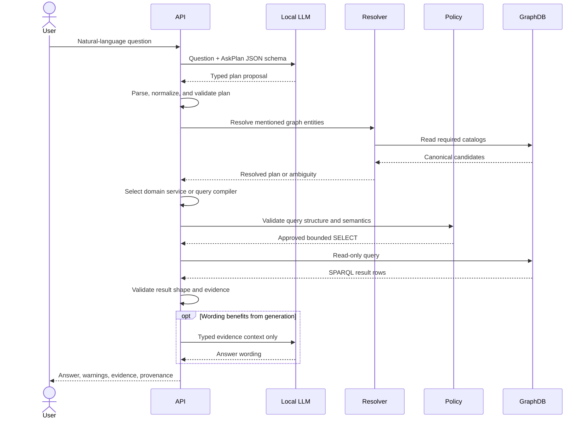

# SakunaGraPH architecture

## System purpose

SakunaGraPH integrates heterogeneous Philippine disaster records into a queryable, provenance-aware
knowledge graph. The system is designed to preserve source identity and uncertainty while giving
public users and researchers a coherent way to explore events, locations, impacts, response
activities, and supporting evidence.

The architecture separates four concerns:

1. Semantic commitments belong to the ontology and SHACL shapes.
2. Source interpretation belongs to source-owned ETL modules.
3. Publication and operational controls belong to the ETL orchestration layer.
4. User-facing retrieval belongs to bounded API services backed by GraphDB.

## Context and components

```mermaid
flowchart TB
    subgraph providers[Independent data providers]
        n[NDRRMC PDFs]
        d[DROMIC web reports]
        g[GDA workbook]
        e[EM-DAT export]
        p[PSGC workbook]
    end

    subgraph etl[SakunaGraPH ETL]
        acquire[Acquisition and parsing]
        contracts[Parsed-data contracts]
        transform[Typed transforms and enrichment]
        mapping[RDF mapping]
        validate[SHACL validation]
        resolution[Entity resolution]
        artifacts[Manifests, lineage, quarantine]
        publish[Transactional publication]
    end

    subgraph runtime[Query runtime]
        graph[(GraphDB)]
        api[FastAPI]
        model[Local OpenAI-compatible model]
        ui[SvelteKit UI]
    end

    providers --> acquire --> contracts --> transform --> mapping --> validate --> resolution
    resolution --> artifacts --> publish --> graph
    contracts -. failed .-> artifacts
    validate -. failed .-> artifacts
    graph --> api --> ui
    model -. typed plans and constrained wording .-> api
```

### Ontology and validation

`ontology/sakunagraph.ttl` defines the OWL domain model. It reuses established vocabularies for
geospatial representation, provenance, classification, and quantities. The SKOS disaster scheme
is maintained separately in `ontology/disaster_type_scheme.ttl`.

SHACL is the graph publication contract. `ontology/shapes/shapes.ttl` validates disaster and impact
data, while `ontology/shapes/psgc/shapes.ttl` validates administrative geography. Parsed-data
contracts catch structural problems earlier; they complement rather than replace SHACL.

### Production ETL

The installable Python 3.12 application is `sakunagraph_etl/`. Every source owns its parser,
transform, RDF mapper, and job beneath `src/sakunagraph_etl/sources/`. Typed dataclasses form the
internal exchange format, and shared concerns live in package-level services:

- `enrichment/` resolves PSGC locations, organizations, disaster types, and climate parameters.
- `rdf/` owns deterministic IRI construction, graph helpers, validation adapters, and publication.
- `resolution/` extracts event features, blocks candidate pairs, scores them, clusters matches, and
  writes deterministic registries and alignment RDF.
- `quality/` owns parsed-data schemas, policy thresholds, reports, and SHACL execution.
- `io/` owns storage, content-addressed artifacts, manifests, GraphDB access, and recovery.
- `orchestration/` executes dependency-aware workflows and emits logs, metrics, alerts, and
  OpenLineage-compatible events.

The top-level `etl/` package is a compatibility boundary for historical commands. It should not
receive new production behavior.

### GraphDB

GraphDB is the runtime system of record. Source facts retain their IRIs and provenance; entity
resolution adds a canonical layer without deleting source records. Production replacement loads
validate the complete publication scope before making network mutations, then preserve rollback
information for recovery.

The API uses the RDF4J-compatible SPARQL protocol through a single adapter. Query construction and
HTTP transport are kept out of routers so graph behavior can be tested without a live repository.

### API and product surface

The FastAPI application is a layered modular monolith:

```text
HTTP routers
    → Pydantic request/response contracts
        → domain services
            → bounded SPARQL adapter
                → GraphDB
```

Feature modules provide analysis, event details, maps, ontology views, direct read-only SPARQL,
and natural-language questions. The SvelteKit frontend consumes these APIs through same-origin
gateway routes and exposes Home, Map, Ontology, Ask, Query, and Analysis surfaces.

## Graph-grounded Ask flow



### Trust boundaries

- Model output is untrusted input. It must satisfy strict Pydantic contracts.
- The original question is never directly interpolated into deterministic SPARQL templates.
- Entity mentions must resolve to approved GraphDB catalog IRIs.
- Ambiguous or missing entities stop execution instead of silently weakening filters.
- SPARQL must parse, use allowed schema terms, remain read-only, and satisfy complexity limits.
- Graph results must match the expected columns, entities, metric, and grouping.
- Generated answers receive typed evidence rather than unrestricted graph access.
- The public product is explicitly not an emergency-alert service.

## Data and artifact flow

A production run creates immutable, content-addressed artifacts and a manifest describing inputs,
outputs, validation status, checksums, and metadata. A failed quality or SHACL gate is written to
`quarantine/` and is ineligible for publication. Successful dependent tasks consume manifests,
not mutable directory conventions.

The resolution registry is incremental and deterministic. Reprocessing the same source members in
a different order does not change the canonical identifier. Source records remain available for
provenance inspection after clustering.

## Deployment modes

| Mode | Execution | Storage and orchestration | Intended use |
| --- | --- | --- | --- |
| Local | Python CLI and local files | Local filesystem, direct commands | Development, fixtures, investigations |
| On-premise | Docker/systemd workers | Mounted storage, timers, Prometheus textfile metrics | Institution-managed infrastructure near GraphDB |
| Cloud | ECS/Fargate workers | S3 artifacts, Step Functions, EventBridge, DynamoDB workflow lock, CloudWatch | Scheduled isolated batch execution |

The web application uses Caddy as the only published port. It routes `/api/*` to FastAPI and other
requests to SvelteKit, supplies trusted forwarded headers, and disables buffering for Ask server-
sent events.

## Major engineering decisions

### RDF and OWL instead of a source-shaped relational union

The sources disagree on event granularity, impact structure, geography, and provenance. RDF keeps
source assertions independently addressable, while OWL/SKOS provide shared meaning and SPARQL
supports relationship-aware questions. The cost is a more specialized toolchain and the need to
make inference assumptions explicit.

### Deterministic rules before model generation

Common analytical questions use domain services or compiled templates. This reduces latency and
prevents an LLM from inventing identifiers or query structure. The trade-off is a bounded intent
surface that must be extended deliberately.

### Source-preserving resolution

Cross-source matches add canonical and alternate relationships rather than overwriting raw entity
identity. This supports auditability and corrections. It also means consumers must understand the
difference between source records and canonical events.

### Local model endpoint

The Ask service targets an OpenAI-compatible local endpoint so sensitive graph context need not be
sent to a hosted provider. This improves deployment control but makes model availability, latency,
and hardware capacity explicit operational dependencies.

### Graph-grounded retrieval without a vector index

The current Ask path retrieves structured graph facts and does not index document chunks or
embeddings. This is intentional and documented: numerical and relationship queries are answered
from validated graph data. Hybrid graph/vector retrieval is future work for narrative questions
whose evidence remains in source documents.

## Verification strategy

- Golden N-Triples detect mapping and identifier drift for all five sources.
- Positive and negative SHACL fixtures exercise semantic publication gates.
- Unit and integration tests cover storage, manifests, recovery, orchestration, resolution, query
  compilation, safety policy, result validation, grounding, and API contracts.
- Browser suites cover responsive behavior, accessibility, streaming, deployment, performance,
  and visual regressions.
- Terraform formatting/validation, dependency auditing, image builds, Python packaging, and the
  application suites are defined under `.github/workflows/`.

The historical Ask evaluation is retained as a baseline rather than presented as current quality.
A consolidated evaluation of the redesigned Ask pipeline remains an explicit next milestone.

## Related records

- `PRODUCT.md` — users, positioning, capabilities, and product principles
- `DESIGN.md` — frontend design system and interaction direction
- `ontology/validation/competency_questions.md` — formal information needs and SPARQL
- `sakunagraph_etl/deploy/adr/` — artifact and orchestration decisions
- `sakunagraph_etl/deploy/runbooks/` — operations, retention, security, and recovery
- `api/README.md` — request lifecycle and Ask safeguards
- `DATA_SOURCES.md` — source acquisition and redistribution boundaries

