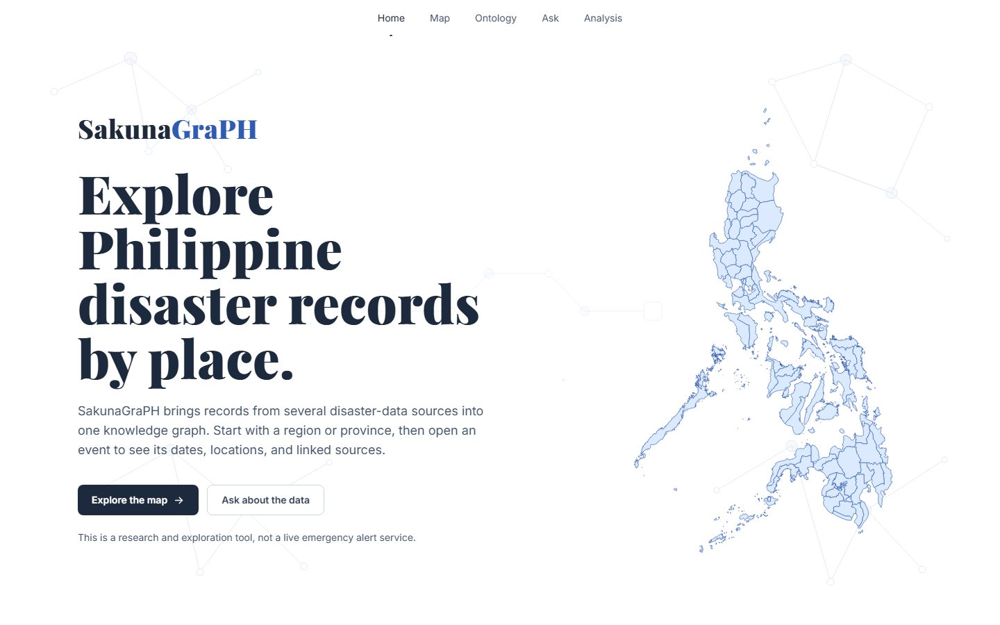
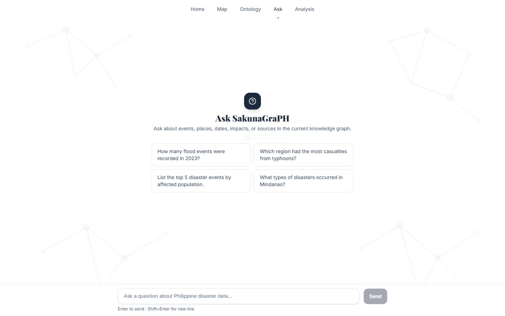
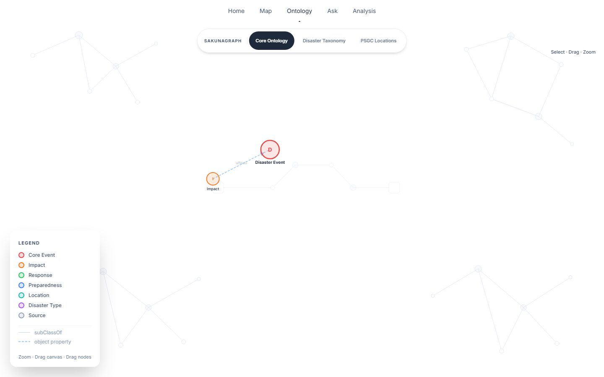

# SakunaGraPH

[](https://github.com/SkIym/SakunaGraPH/actions/workflows/etl-quality.yml)
[](https://github.com/SkIym/SakunaGraPH/actions/workflows/frontend-quality.yml)
[](https://github.com/SkIym/SakunaGraPH/actions/workflows/etl-security.yml)
[](https://github.com/SkIym/SakunaGraPH/actions/workflows/portfolio-smoke.yml)
[](https://github.com/SkIym/SakunaGraPH/releases/tag/sakunagraphv.1.0)
[](LICENSE)

**An ontology-based knowledge graph for integrating and exploring Philippine disaster data.**

SakunaGraPH turns heterogeneous situation reports, spreadsheets, and public data into a
provenance-aware RDF graph. It combines an OWL 2 ontology, source-specific ETL, SHACL quality
gates, cross-source entity resolution, GraphDB-backed APIs, and a public exploration interface.

> SakunaGraPH is a research and data-exploration system. It is not a live emergency warning
> service and should not be used for operational disaster response.

[Explore the hosted application](https://sakunagraph.upcsweb.dev) ·
[Download the v1.0 knowledge graph and ontology](https://github.com/SkIym/SakunaGraPH/releases/tag/sakunagraphv.1.0) ·
[Read the architecture](ARCHITECTURE.md) ·
[Run the two-minute RDF demo](#two-minute-rdf-demo)



| Ask the graph | Inspect the semantic model |
| --- | --- |
|  |  |

## Why this project exists

Philippine disaster information is distributed across agencies and formats. The same event can
appear under different names, geographic descriptions, report revisions, and impact structures.
SakunaGraPH creates a shared semantic layer without erasing those source differences:

- **One domain model:** OWL and SKOS represent disasters, impacts, response actions,
  organizations, provenance, and Philippine administrative geography.
- **Five source pipelines:** NDRRMC, DROMIC, GDA, EM-DAT, and PSGC data are parsed into typed
  records and mapped to deterministic RDF.
- **Quality before publication:** parsed-data contracts and SHACL validation quarantine invalid
  outputs before they can replace a published graph.
- **Cross-source identity:** blocking, scoring, and deterministic clustering connect related event
  records while preserving their original identities and provenance.
- **Multiple ways to explore:** users can ask natural-language questions, execute read-only
  SPARQL, inspect events, browse the ontology, use a map, and analyze temporal or impact patterns.

## What is implemented

| Capability | Evidence in the repository |
| --- | --- |
| Semantic model | OWL 2 ontology, SKOS disaster taxonomy, GeoSPARQL, PROV-O, and QUDT alignment |
| Data integration | PDF, XLSX, and web ingestion for five disaster and reference-data sources |
| Data quality | Versioned parsed-data contracts, SHACL, immutable manifests, quarantine, and golden RDF fixtures |
| Entity resolution | Feature extraction, candidate blocking, pair scoring, deterministic clustering, and an incremental registry |
| Graph access | GraphDB/RDF4J SPARQL endpoint behind bounded, read-only FastAPI services |
| Graph-grounded QA | Structured planning, graph-backed entity resolution, deterministic service/compiler routes, query validation, evidence IDs, and constrained answer generation |
| Product surface | Responsive SvelteKit application with map, ontology, Ask, SPARQL, event, and analysis views |
| Operations | Docker, Caddy, AWS Step Functions/ECS Terraform, content-addressed artifacts, rollback, Prometheus metrics, OpenLineage events, and runbooks |
| Verification | Python unit/integration tests plus frontend contract, end-to-end, streaming, accessibility, performance, and visual regression suites |

### Engineering snapshot

These counts describe repository artifacts, not claims of complete real-world coverage. Run
`scripts/portfolio_demo.py` to reproduce the ontology and fixture counts.

| Artifact | Current evidence |
| --- | ---: |
| Integrated sources | 5 |
| Named OWL classes | 50 |
| OWL object properties | 60 |
| OWL datatype properties | 111 |
| SKOS disaster concepts | 98 |
| SHACL node / property shapes | 49 / 242 |
| Documented competency questions | 20 |
| Immutable five-source smoke graph | 79 triples |

The retained full-data migration baseline records 30,955 EM-DAT triples, 16,088 PSGC triples,
and 13,047 GDA triples. NDRRMC and DROMIC are fixture-baselined because their document inputs and
enrichment models are operational dependencies rather than redistributable repository data. See
the [baseline record](sakunagraph_etl/docs/stage0-baseline.md) for checksums and scope.

## Architecture

```mermaid
flowchart LR
    raw["Raw PDF / XLSX / web data"] --> source["Source parsers and transforms"]
    source --> quality["Parsed-data quality contracts"]
    quality --> enrich["Location, organization, and type enrichment"]
    enrich --> rdf["Deterministic RDF mappings"]
    rdf --> shacl["SHACL validation"]
    shacl --> resolve["Cross-source entity resolution"]
    resolve --> graphdb[(GraphDB)]

    graphdb --> api["FastAPI graph services"]
    api --> web["SvelteKit exploration UI"]
    llm["Local OpenAI-compatible LLM"] -. "structured planning and evidence-constrained wording" .-> api

    quality -. "reject" .-> quarantine["Quarantine"]
    shacl -. "reject" .-> quarantine
```



The LLM never connects directly to GraphDB. It proposes a typed plan—and, only for the constrained
open-query fallback, a SPARQL query—that deterministic code validates before read-only execution.
Common analytical questions use tested domain services or fixed query templates.

SakunaGraPH currently uses **graph-grounded retrieval**, not text-chunk/vector retrieval. It does
not yet build embeddings or maintain a vector index. The exact boundary and safeguards are
documented in the [API deep dive](api/README.md#current-graphrag-scope).

Read [ARCHITECTURE.md](ARCHITECTURE.md) for component boundaries, data flow, trust boundaries,
deployment modes, and the major engineering trade-offs.

## Two-minute RDF demo

The smoke demo uses the repository's synthetic, checksum-verified golden fixtures. It does not
need raw source data, GraphDB, Docker, or an LLM.

Requires Python 3.12. On Windows PowerShell:

```powershell
python -m venv .venv
.venv\Scripts\python -m pip install rdflib==7.6.0
.venv\Scripts\python scripts/portfolio_demo.py
```

On macOS or Linux:

```bash
python3 -m venv .venv
.venv/bin/python -m pip install rdflib==7.6.0
.venv/bin/python scripts/portfolio_demo.py
```

The command verifies all five fixture digests, parses the ontology and SHACL graphs, combines the
source RDF, and runs a SPARQL query over the resulting in-memory graph.

```text
Verified source fixtures : 5 (dromic, emdat, gda, ndrrmc, psgc)
Combined fixture triples : 79
Named OWL classes        : 50
SKOS disaster concepts   : 98
SHACL node shapes        : 49
SHACL property shapes    : 242

PASS: semantic artifacts parsed, fixture evidence verified, and SPARQL executed.
```

For a guided presentation of the product and engineering decisions, use the
[five-minute portfolio walkthrough](docs/portfolio-walkthrough.md).

## Run the production ETL

The supported ETL application lives in `sakunagraph_etl/` and exposes the unified `sakuna-etl`
command. From that directory:

```bash
python -m pip install --editable . --constraint constraints.txt
python -m unittest discover -s tests -t . -v
sakuna-etl --help
```

Source examples, document-processing extras, alignment, publication, and production profiles are
covered in the [ETL guide](sakunagraph_etl/README.md). The sibling `etl/` tree contains preserved
compatibility wrappers and historical commands; new production behavior belongs in the standalone
package.

## Run the web application

The application Compose stack contains the Caddy gateway, SvelteKit frontend, and FastAPI service.
It expects two services to be available on the host or at configured URLs:

1. A GraphDB/RDF4J repository containing the SakunaGraPH ontology and data.
2. An OpenAI-compatible local model endpoint for the Ask planner and conditional answer wording.

Copy `.env.compose.example` to `.env`, update the endpoints, then run:

```bash
docker compose up --build --wait
```

Open `http://localhost:8080`. The gateway exposes the application under one origin and preserves
unbuffered Ask streaming. See [deploy/README.md](deploy/README.md) for health checks and the tested
deployment contract.

## Questions the graph is designed to answer

- How many flood events were recorded in 2023?
- Which region had the most reported casualties from tropical cyclones?
- List the top five disaster events by affected population.
- What source reports support the figures shown for a specific event?
- Which provinces in Eastern Visayas reported totally versus partially damaged houses?
- Which organizations contributed assistance, and to which locations?

Twenty formal competency questions and their SPARQL are maintained in
[`ontology/validation/competency_questions.md`](ontology/validation/competency_questions.md).

## Quality and safety model

- Source rows pass typed contracts before transformation.
- RDF outputs pass SHACL before production publication.
- Deterministic UUID5 identifiers make reruns stable.
- Content-addressed manifests make artifacts reproducible and auditable.
- Invalid runs are quarantined rather than promoted.
- Cross-source matches retain source identities through provenance-aware alignment statements.
- Public SPARQL and generated queries are restricted to bounded `SELECT` operations.
- Unresolved or ambiguous entities stop query execution instead of silently dropping filters.
- Generated wording is constrained to validated rows, units, evidence IDs, and provenance.

The original Ask baseline is intentionally retained, including its failures, in
[`api/evaluation/`](api/evaluation/). It must not be interpreted as a current-pipeline quality
claim; a consolidated post-redesign evaluation remains future work.

## Repository map

```text
SakunaGraPH/
├── ontology/          OWL ontology, SKOS taxonomy, SHACL shapes, validation artifacts
├── sakunagraph_etl/   installable production ETL, resolution, quality, storage, deployment
├── api/               FastAPI graph, analysis, SPARQL, and graph-grounded Ask services
├── frontend/          SvelteKit application and browser-level verification suites
├── deploy/            Caddy and application Compose documentation
├── etl/               historical compatibility wrappers
├── scripts/           infrastructure-free portfolio smoke demo
├── ARCHITECTURE.md    system boundaries and engineering decisions
└── DATA_SOURCES.md    source access, attribution, and redistribution boundaries
```

## Documentation

- [System architecture](ARCHITECTURE.md)
- [Five-minute portfolio walkthrough](docs/portfolio-walkthrough.md)
- [Data sources and licensing boundaries](DATA_SOURCES.md)
- [Ontology guide](ontology/README.md)
- [Production ETL guide](sakunagraph_etl/README.md)
- [API and Ask pipeline](api/README.md)
- [Application deployment](deploy/README.md)
- [ETL deployment and operations](sakunagraph_etl/deploy/README.md)
- [Contribution guide](CONTRIBUTING.md)
- [Changelog](CHANGELOG.md)

## Data and license

Original SakunaGraPH code, documentation, and ontology content authored by the project are
available under the [MIT License](LICENSE). That license does **not** grant rights to third-party
source datasets, reports, imported ontologies, logos, or trademarks. Raw data is intentionally
excluded from version control. Each user must obtain source data independently and comply with its
current terms. See [DATA_SOURCES.md](DATA_SOURCES.md).

## Project status

The [v1.0 release](https://github.com/SkIym/SakunaGraPH/releases/tag/sakunagraphv.1.0)
publishes the knowledge graph and ontology baseline. Development continues on the ETL, graph-grounded
Ask pipeline, deployment, and public interface. The repository demonstrates implemented
architecture, tests, and reproducible fixtures; it does not establish complete historical
coverage, real-time freshness, customer adoption, or an emergency-service reliability guarantee.
